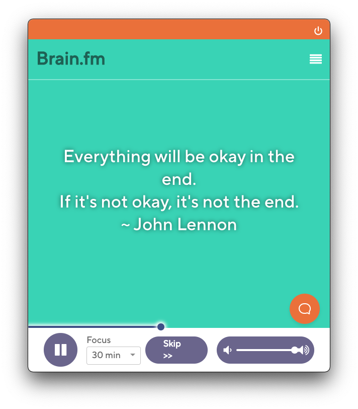

<div align="center">
	<a href="https://github.com/noahflk/brainfm-menubar-client">
		
	</a>
	<h1>Brain.fm Menubar Client</h1>
	<p>
		<b>Listen to and control Brain.fm right from your computer's menubar</b>
	</p>
	<br>
	<br>
	<br>
</div>

## Disclaimer

This project is in no way whatsoever associated to Brain.fm or the makers of this product. I do not hold the rights to the name Brain.fm or the corresponding app icon. All this application does is provide a wrapper for the official Brain.fm website that lives in your system tray/menubar.

A few lines of JS and CSS are injected into the Brain.fm website when using this application in order to add a quit button and media controls. You can see this in `src/index.js`.

## Screenshot



## Build

To build the production application on your own, run this command:

```bash
# Install the dependencies
yarn install

# Build the executeable
yarn make
```

## Development

```bash
# Install the dependencies
yarn install

# Run the application in dev mode
yarn start
```
